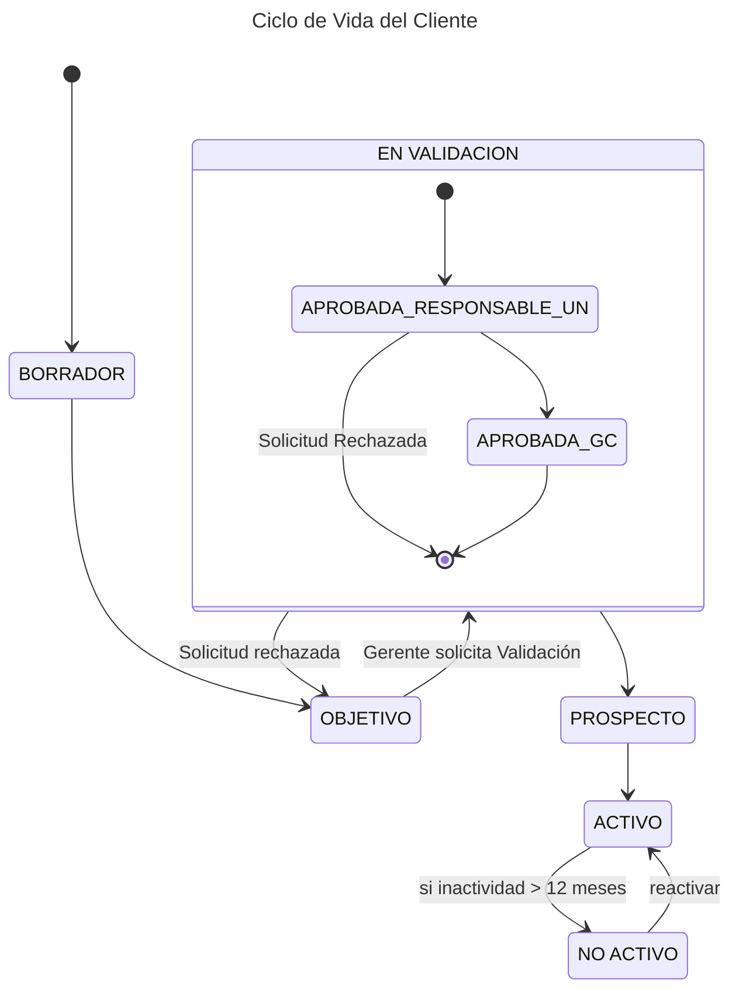

---
tags:
  - Entity
aliases:
  - Clientes
  - Cuenta
  - Cuentas
---

El Cliente pertenece a una [[Unidad de Negocio]] y estará por tanto sujeto a la estrategia de la Unidad.

Los Clientes pueden encajar en alguna de las siguientes categorías:
- Objetivo: Se considera a aquella entidad que cumple los parámetros por los que debería llegar a ser Cliente activo en algún momento. Los Clientes objetivo no tendrán código identificador de cliente en BABEL, ni actividad comercial directa hacia ellos por parte de nadie de BABEL.
- Prospect: Es un Cliente objetivo en el que desde BABEL se decide iniciar una actividad comercial específica para convertirle en Cliente activo. El inicio de la actividad comercial para un Prospect debe validarla siempre el responsable de la [[Unidad de Negocio]] al que corresponda dicho Cliente, para hacerlo deberá solicitarse identificador de Cliente de BABEL y le daremos de alta en nuestra base de datos de Clientes.
- Activo: Un Cliente Prospect pasa a considerarse Cliente Activo en el momento que se da de alta un [[Proyecto]] con ingresos a facturar, gastos y/o compras.
- No Activo: En el momento que se cumpla un periodo de 12 meses sin que en un Cliente Activo haya declaración de ingresos y/o generación de nuevas facturas, y sin que exista ninguna deuda, pasará a considerarse Cliente No Activo. Mantendrá su código identificador de Cliente en BABEL 

# Atributos

| **Atributo**                            | **Descripción**                                                                                                                                                                                  | **Tipo**     |
| --------------------------------------- | ------------------------------------------------------------------------------------------------------------------------------------------------------------------------------------------------ | ------------ |
| Código*                                 | Código del Cliente. Este código se genera automáticamente correlativo al último que exista. Los Clientes no tendrán código hasta que lleguen al estado Prospect (una vez superada la validación) | Alfanumérico |
| Estado*                                 | Estado del cliente.                                                                                                                                                                              | Alfanumérico |
| Porcentaje creación                     | Se rellenará cuando el Cliente está en estado Borrador para ver el porcentaje que está relleno según los pasos rellenados en la ficha de creación.                                               |              |
| Oficina*                                | Oficina a la que pertenece el Cliente. Por defecto se rellenará con la Oficina del creador, pero se permitirá cambiar.                                                                           | Alfanumérico |
| Nombre*                                 | Nombre del Cliente                                                                                                                                                                               | Alfanumérico |
| Razón Social*                           | Nombre completo del Cliente. Por defecto será igual al nombre, pero se permitirá modificar.                                                                                                      | Alfanumérico |
| [[País]]*                               | País al que pertenece el Cliente.                                                                                                                                                                | Alfanumérico |
| Responsable                             | Usuario Responsable del cliente. Será un usuario de rol [[Gerente]] o [[Director]].                                                                                                              | Alfanumérico |
| Tipo de número de identificación fiscal | Desplegable con distintos tipos dependiente del país. Obligatorio para activar el cliente.                                                                                                       | Alfanumérico |
| Número de identificación fiscal         | Número de identificación fiscal. Obligatorio para activar el cliente.                                                                                                                            | Alfanumérico |
| [[Unidad de Negocio]]                   | Comando de ventas al que se asigna. Obligatorio si el cliente pertenece a una oficina en la que hay unidades de Negocio                                                                          | Alfanumérico |
| [[Sector]]                              | Desplegable con sectores de Cliente                                                                                                                                                              | Alfanumérico |
| Número de empleados*                    | Número de empleados del cliente                                                                                                                                                                  | Numérico     |
| Web del cliente*                        | Url de la página web del cliente                                                                                                                                                                 | Alfanumérico |
| Facturación anual €*                    | Número de empleados del cliente                                                                                                                                                                  | Numérico     |
| Inversión anual en tecnología € *       | Número de empleados del cliente                                                                                                                                                                  | Numérico     |
| Fecha Alta*                             | Fecha de alta del Cliente. Se rellenará de forma automática.                                                                                                                                     | Fecha        |
| Fecha Activación*                       | Fecha de activación del Cliente. Se rellenará de forma automática.                                                                                                                               | Fecha        |
| Fecha Última Modificación*              | Fecha de última modificación. Automático                                                                                                                                                         | Fecha        |
| Usuario Última Modificación*            | Usuario Última modificación. Automático.                                                                                                                                                         | Alfanumérico |

# Ciclo de Vida

Los estados por los que puede pasar un Cliente son:
- BORRADOR. La descripción del Cliente existe en el BHZ pero sólo es visible para el Responsable ya que no está aún completa. El Cliente aún no tiene Código.
- OBJETIVO: El Gerente/Director ya ha finalizado la creación del Cliente. El cliente ya es visible para todos los usuarios, pero aun no está Activo ni tiene un Código de cliente. No se pueden crear [[Oportunidades]] para este Cliente. Sería un Cliente que cumple los parámetros por los que debería llegar a ser Cliente Activo, pero en el que aun no se ha decidido tener actividad comercial.
- EN VALIDACIÓN: Una vez se decide iniciar actividad comercial en el Cliente el [[Gerente]] lo pasa al estado de Validación, en el que, primero el Responsable de la [[Unidad de Negocio]] y luego [[Control de Gestión]] validan la información introducida. Hasta que no realizan la validación de los datos al Cliente no se le asigna un código y no se pueden crear oportunidades en él. Al validar el Cliente este pasará al estado Prospect. 
- PROSPECT: Cuando Control de Gestión valida la activación del cliente este pasa al estado Prospect. Ya tiene código de cliente y se pueden crear oportunidades en él. Los clientes en este estado deberán aparecer en los ejercicios semestrales de presupuesto incluidos en sus respectivas Unidades de Negocio. 
- ACTIVO: Un cliente Prospect pasa a considerarse cliente activo en el momento que se da de alta un proyecto con ingresos a facturar, gastos y/o compras. A todos los efectos en BHZ el paso a estado Activo será automático cuando la primera oportunidad pase al estado Ganada. ▪
- NO ACTIVO: En el momento que se cumpla un periodo de 12 meses sin que en un cliente Activo haya declaración de ingresos y/o generación de nuevas facturas, y sin que exista ninguna deuda, pasará a considerarse cliente No activo. Mantendrá su código identificador de cliente en BABEL y permanecerá en nuestra base de datos pero etiquetado como Cliente No activo. En este estado no se podrán crear oportunidades. Para retomar la actividad comercial será necesario que su responsable pase el cliente de nuevo a Prospect.

# Criterios de Aceptación
A continuación se definen los criterios utilizados para validar un Cliente:
- Qué no esté duplicado
- Que no pertenezca a otro Cliente (estructura matricial)
- Que cumpla las condiciones de Tamaño y Presupuesto en IT