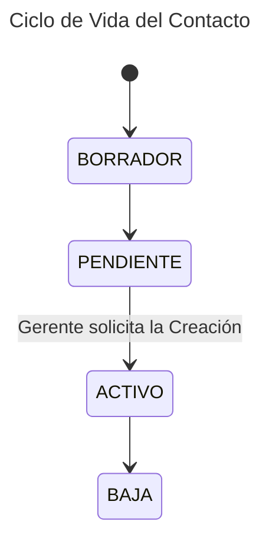

---
tags:
  - Entity
aliases:
  - Contactos
---
Persona de Referencia dentro de un [[Cliente]] o un [[Partner]] y que estará vinculada con alguna [[Oportunidad]].

Un Contacto pertenece a un [[Cliente]] en el momento actual pero puede haber trabajado en otros [[Ontology/Cliente|Clientes]] anteriormente.

Tendrá dos identificadores: uno personal y otro corporativo (correo corporativo)

# Atributos 

| **Atributo**     | **Descripción**                                                  | **Tipo**                       |
| ---------------- | ---------------------------------------------------------------- | ------------------------------ |
| Nombre*          |                                                                  | Alfanumérico                   |
| Apellidos*       |                                                                  | Alfanumérico                   |
| Email            |                                                                  | Email                          |
| Responsable      | Usuario que tiene la responsabilidad interna sobre este Contacto | [[Usuario]]                    |
| Idioma GDPR      | Uno de los idiomas oficiales de BABEL                            |                                |
| Teléfono Trabajo |                                                                  | Teléfono                       |
| Teléfono móvil   |                                                                  | Teléfono                       |
| País             |                                                                  | [[País]]                       |
| Dirección        | Ciudad, Código Postal, Calle, Número, Piso                       | Dirección                      |
| Colaboradores    | Lista de Colaboradores                                           | [[Colaborador\|Colaboradores]] |

# Ciclo de Vida
Un Contacto pasa por los siguientes estados:
- BORRADOR: No se ha finalizado la creación del Contacto. En este estado sólo es visible para el Usuario creador.
- PENDIENTE. Se ha enviado una solicitud de Aprobación de un [[Contacto]] y debe ser aprobado por [[Control de Gestión]]. Una vez aprobado pasa al estado ACTIVO
- ACTIVO: Contacto activo.
- BAJA: El Contacto ha sido dado de baja.

