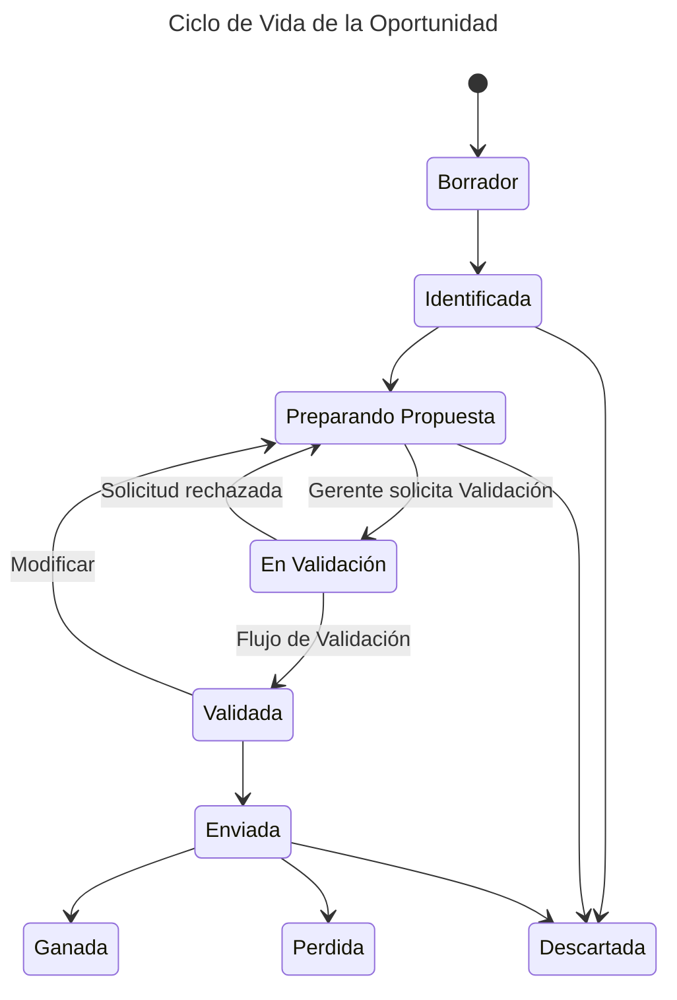

---
tags:
  - Entity
aliases:
  - Oportunidades
---
# Descripción
Representa un posible negocio o proyecto que se está considerando y gestionando dentro de la Aplicación [[BABEL HUNTING ZONE|BHZ]]. 
Esta entidad captura todos los detalles relevantes de una Oportunidad desde su creación hasta su cierre, ya sea como ganada, perdida o descartada.

# Atributos

- Código. Identificador de la Oportunidad. Se trata de un código numérico incremental.
- Título. Breve descripción de la Oportunidad.
- Descripción. 
- Responsable. El [[Gerente]] responsable del desarrollo de la [[Oportunidad]]. Generalmente también el Responsable del [[Cliente]], aunque puede haber Clientes con más de un Gerente a su cargo.
- Colaboradores
- [[Unidad de Negocio]]
- [[Cliente]]
- [[Área de Operaciones]]
- Lista de [[Contactos]]
- Estado
- Probabilidad. Indica en el porcentaje de probabilidad de ganar esta Oportunidad.  (valores posibles: 10-25-50-75-90%)
- [[Proyecto]] Asociado. Indica que esta Oportunidad está relacionada con un Proyecto existente.
- Fecha de Creación. 
- [[Actividad]] Principal 
- [[Tecnología|Tecnologías]]. Lista de Tecnologías implicadas en la Oportunidad. 
- Fechas de Cierre. Fecha en el que la Oportunidad cambia a un estado final.
- Comentarios. 
- Destacada. Indica con un valor booleano si la Oportunidad es una referencia. 

- [ ] Cambiar a formato Tabla

# Ciclo de vida
Una Oportunidad puede pasar por los siguientes estados:

- **Borrador** (DRAFT). La Oportunidad aún no está registrada en el sistema porque está incompleta, sin embargo la información facilitada se almacena en el sistema para ayudar al [[Gerente]] responsable a cumplimentarla.
	- Acción: El Usuario pulsa el botón Finalizar para pasarla al estado Identificada. La Oportunidad debe tener rellenos todos sus campos obligatorios para poder cambiar de estado.
- **Identificada** (IDENTIFIED). La Oportunidad está registrada con una definición baja. Aún hay que trabajar la Oportunidad antes de poder entregar una Propuesta. 
	- Acción: El Usuario puede editar la Oportunidad para añadir más información (como por ejemplo la probabilidad) y mantenerla en este estado. 
- **Preparación Propuesta** (IN_PROGRESS). Existe un equipo trabajando en la [[Propuesta]], generalmente respondiendo a una necesidad del Cliente en forma de [[RFP]]. En esta etapa uno de los entregables fundamentales es la [[Hoja de Valoración]]
- **En Validación** (VALIDATING). La Propuesta está finalizada o casi finalizada pero puede pasarse a Validar para pasar los Controles de Validación. Los Validadores dependerán de las características de la Propuesta, cómo por ejemplo, tipo de Cliente o importe de la [[Oferta.]]. No puede llegarse a este estado si la Oportunidad no tiene una [[Hoja de Valoración]]
	- Acción Salida. 
- **Validada** (VALIDATED). La Oferta ha sido revisada y validada por los [[Validador]] correspondientes y por tanto puede ser enviada al [[Cliente]]. La Propuesta tiene un [[Código de Validación de la Propuesta]] facilitado por el área de [[Control de Gestión]]
	- Acción de Salida: Si el Responsable o alguno de los Colaboradores modifica la Oportunidad es necesario volver a pasar el ciclo de validación. En este caso la Oportunidad volvería al estado Preparación Propuesta. 
- **Propuesta Enviada** (SENDED). El [[Gerente]] ha enviado la [[Propuesta]] al Cliente y nos mantenemos a la espera de feedback. 
- **Ganada** (WIN). El [[Cliente]]nos comunica que hemos sido ganadores y adjudicatarios de la [[Propuesta|Oferta]]
	- Acción Salida. Cuando se gana una Oportunidad se crea automáticamente un [[Proyecto]] en [[PROJECT MANAGEMENT ZONE|PMZ]] trasladando los datos de la Oferta y manteniendo el Proyecto en estado Borrador.
- **Perdida** (LOST). El [[Cliente]] nos comunica que nuestra [[Propuesta|Oferta]] no ha resultado ganadora. 
	- Acción Salida: Un formulario indicando el motivo es lanzado al Usuario para realizar análisis. 
- **Descartada** (DISCARD). El Cliente decide no continuar con el proceso de licitación y la [[Oportunidad]] se cierra sin ningún ganador.

El siguiente diagrama muestra el Ciclo de Vida y las relaciones entre Estados:

- Una Oportunidad está Abierta si está en cualquier estado no final (por ejemplo, Ganada o Perdida)
- Sólo el Responsable y los [[Colaborador|Colaboradores]] de la [[Oportunidad]] podrán cambiar el estado de la Oportunidad
- Una Oportunidad está Pendiente si está Abierta y esperando una acción por parte del Usuario que ve la Oportunidad. Por ejemplo, una Oportunidad puede estar Pendiente de Validación por parte de un usuario de [[Control de Gestión]].
- Las Oportunidades Validadas obtienen un [[Código de Validación de la Propuesta]]. 

## Flujo de Validación 
El flujo de validación indica las validaciones que son necesarias para validar una Oportunidad una vez el Responsable la pasa a Validación. 
El flujo es dinámico y depende de parámetros tales como la [[Oficina]], [[Unidad de Negocio]], el importe, etc. 
El flujo se determina a través de [[Regla de Validación|Reglas de Validación]]. 